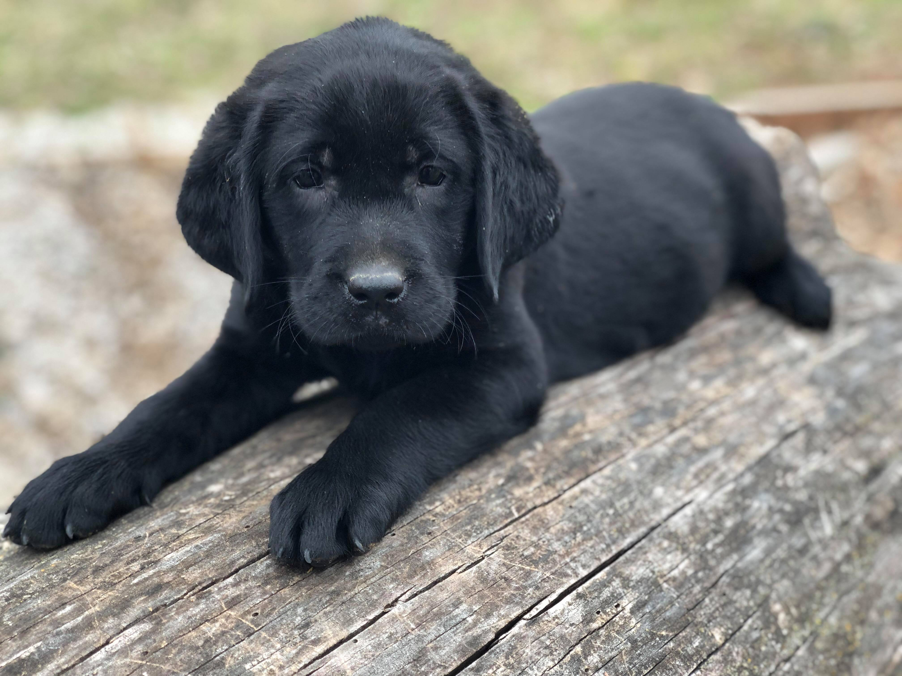
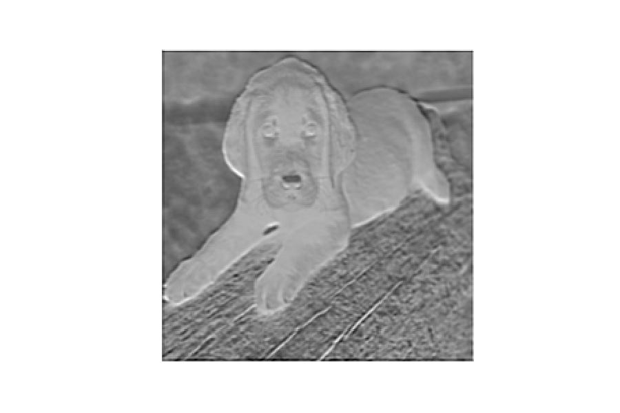
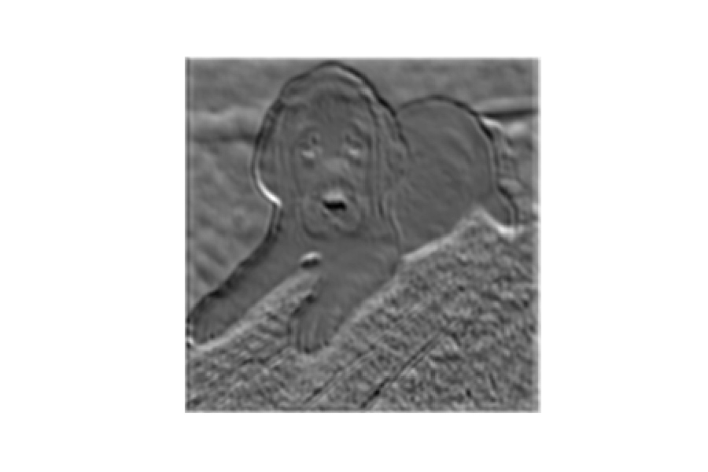
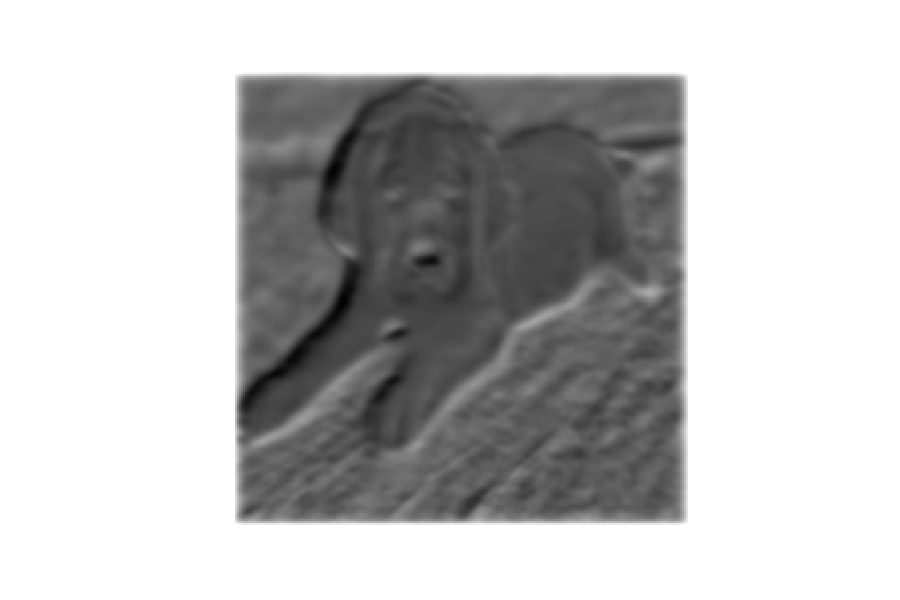

# Convolutional Neural Network Visualizations 

This repository is an attempt for me to visually represent the inner workings of convolutional neural networks. This work is by no means revolutionary, however, I am trying to illustrate various methods for representing how a CNN makes decisions. In this effort I hope to understand the fine details of CNNs. Deep neural networks do not have to be black boxes. It may seem that it is some miracle that a model can identify a cat in an image, but believe me, it's not. It's just really complicated math under the hood. I believe that every ML engineer should understand how their model makes decisions, which ultimatly should answer questions related to bias. I'm new at this so bare with me...

### Navigation
* [Running Notebook Locally](#installing_locally)
* [Filter Visualization](#filter_vis)
* [Feature Map Visualization](#feature_map_vis)
* [More Filter Visualization](#more_filter)
* [References](#referances)

<a id='installing_locally'></a>
## Installing Locally
If you are new to this, feel free to install locally and make it your own.
1. Install dependencies (I recommended that you create an environment in Conda-Python3)  
>`pip install requirments.txt`
2. The following Jupyter notebooks outline various visualization methods:
    * `cnn_filter_visualizations.ipynb` Jupyter notebook 

<a id='filter_vis'></a>
## Filter Visualization

Generally speaking, filters in a CNN are used to extract information from an image that is then passed through the network to make predictions. These filters are called kernels. Mathmatically they perform operations on pixels that reduce an image to basic features. Each CNN layer can have hundreds of layers (kernels). These layers make up the depth of a CNN. The following gif<sup>[[1]](#1)</sup> illustrates how a filter is applied to an an image:

<p align="center">

</p>

### Model Architecture

In order to visualize the various filters and feature maps of a neural netork we first need to load a pre-trained network from Pytorch. We will use the VGG16<sup>[[2]](#1)</sup> neural network and extract each corresponding convolutional layer. We will not performing backpropagation. Instead, we will use each layer's weights to help visualize the filters used and the resulting image processing.

### Filter Layers

Taking a look at 3 of the 13 convolutional layers in the VGG16 model we see that there is increased depth as we move through the model. The following images illustrate each filter in the respective layers. **Note:** The filters are displayed in grayscale for readability.

<table border=0 width="800px" align="center">
	<tbody> 
    <tr>		
            <td width="20%" align="center"> Layer 1: 3x3 Kernel: Depth 64 </td>
			<td width="20%" align="center"> Layer 5: 3x3 Kernel: Depth 256 </td>
			<td width="20%" align="center"> Layer 10: 3x3 Kernel: Depth 512 </td>
		</tr>
		<tr>
			<td width="20%" align="center">  </td>
			<td width="20%" align="center">  </td>
			<td width="20%" align="center">  </td>
		</tr>
	</tbody>
</table>

<a id='feature_map_vis'></a>
## Feature Map Visualization

When we pass an image into the pre-trained network we process it at each layer and save the respective image representation. This is essentially what the image looks like after each filter is applied. First we will pass in an adorable picture of a black lab. Yea, I know. 

<p align="center">

</p>

When we pass the image through the first convolutional layer we will essentially get 64 corresponding filtered images. Let's take a look at when kernel 17 is applied to the image on layer 1. **Note:** There is some preprocessing that was done which is why the image looks squished. 

<p align="center">

</p>

### Processing Through Mulitple Layers
After some pre-processing the below block of code takes an image and applies it to each `torch.nn.Conv2d` layer. The output of one layer is the input to the next. 

```python
    # Pass image through the first convolutional layer 
    # save the outpue
    conv_out = [conv_layers[0](image)]
    # Iteratively pass image through all convolutional layers
    for i in range(1, len(conv_layers)):
        conv_out.append(conv_layers[i](conv_out[-1]))
```
The depth of Layer 1 is 64. You can see how each filter extracts different details from the image. Layer 1 feature maps are fairly clear. As we move deeper into the model we can see how the detail in the image starts to degrade. Can you pick out what the feature maps are representing? Sometimes the outline of the image is clear, sometimes dark colors are emphesized, and sometimes it is hard to tell it what the image is originally of. 

<table border=0 width="800px" align="center">
	<tbody> 
    <tr>		
            <td width="20%" align="center"> Layer 1: 3x3 Kernel </td>
			<td width="20%" align="center"> Layer 1: Filtered Images </td>
		</tr>
		<tr>
			<td width="20%" align="center">  </td>
			<td width="20%" align="center">  </td>
		</tr>
	</tbody>
</table>
<table border=0 width="800px" align="center">
	<tbody> 
    <tr>		
            <td width="20%" align="center"> Layer 2</td>
			<td width="20%" align="center"> Layer 4</td>
            <td width="20%" align="center"> Layer 6</td>
		</tr>
		<tr>
			<td width="20%" align="center">  </td>
			<td width="20%" align="center">  </td>
            <td width="20%" align="center">  </td>
		</tr>
	</tbody>
</table>
<table border=0 width="800px" align="center">
	<tbody> 
    <tr>		
            <td width="20%" align="center"> Layer 8</td>
			<td width="20%" align="center"> Layer 10</td>
            <td width="20%" align="center"> Layer 12</td>
		</tr>
		<tr>
			<td width="20%" align="center">  </td>
			<td width="20%" align="center">  </td>
            <td width="20%" align="center">  </td>
		</tr>
	</tbody>
</table>

<a id='more_filter'></a>
## More Filter Visualization


<a id='references'></a>
## References
[1]<a id='1'></a> https://github.com/vdumoulin/conv_arithmetic  

[2]<a id='2'></a> *Very Deep Convolutional Networks for Large-Scale Image Recognition.* Simonyan, K.,
Zisserman, A. 2015.  
&nbsp;&nbsp;&nbsp;&nbsp;&nbsp;&nbsp;https://arxiv.org/abs/1409.1556
